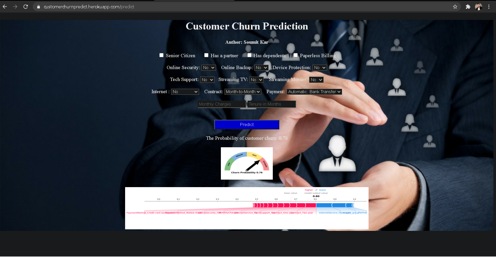

# Customer-Survival-and-Churn-Prediction
Customer churn is one of the most important metrics for a growing business to evaluate. While it's not the happiest measure, it's a number that can give your company the hard truth about its customer retention.
Heroku app
My Heroku app : https://customerchurnpredict.herokuapp.com/

# SURVIVAL ANALYSIS

Survival analysis is a branch of statistics for analyzing the expected duration of time until one or more events happen, such as death in biological organisms and failure in mechanical systems.

Kaplan-Meier Curve (My Blog) - https://medium.com/@soumitkar.5/kaplan-meier-curve-6319a978c451

STEPS

step 1

Problem Defination

The key challenge is to predict if an individual customer will churn or not.

step 2

Data Collection

The data set for this classification problem is taken from Kaggle and stems from the IBM sample data set collection (https://www.kaggle.com/blastchar/telco-customer-churn).

step 3

Exploratory Data Analysis

After data collection, several steps are carried out to explore the data. Goal of this step is to get an understanding of the data structure, conduct initial preprocessing, clean the data, identify patterns and inconsistencies in the data (i.e. skewness, outliers, missing values) and build and validate hypotheses.

Step 4

Feature Engineering

In feature engineering, a new feature is generated from extisting features and a correlation analysis is conducted after all features have been transformed to numerical.

Step 5 

Train-Test-Split

The data set is split into 80% training data and 20% test data. The “Churn” column is defined as the class (the “y”), the remaining columns as the features (the “X”).

Step 6

Model Evaluation Metrics

For performance assessment of the chosen models, various metrics are used:

Feature weights: Indicates the top features used by the model to generate the predictions

Confusion matrix: Shows a grid of true and false predictions compared to the actual values

Accuracy score: Shows the overall accuracy of the model for training set and test set

ROC Curve: Shows the diagnostic ability of a model by bringing together true positive rate (TPR) and false positive rate (FPR) for different thresholds of class predictions (e.g. thresholds of 10%, 50% or 90% resulting to a prediction of churn)

AUC (for ROC): Measures the overall separability between classes of the model related to the ROC curve

Precision-Recall-Curve: Shows the diagnostic ability by comparing false positive rate (FPR) and false negative rate (FNR) for different thresholds of class predictions. It is suitable for data sets with high class imbalances (negative values overrepresented) as it focuses on precision and recall, which are not dependent on the number of true negatives and thereby excludes the imbalance

F1 Score: Builds the harmonic mean of precision and recall and thereby measures the compromise between both.

AUC (for PRC): Measures the overall separability between classes of the model related to the Precision-Recall curve

# Built with

<code></code>
<code></code>
<code></code>
<code></code>
<code></code>
<code></code>

 "APP")

 "APP")

 "APP")

 "APP")

